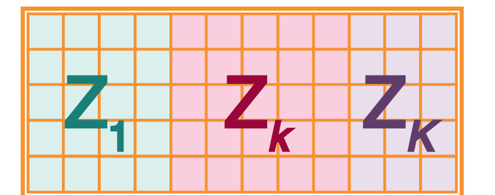
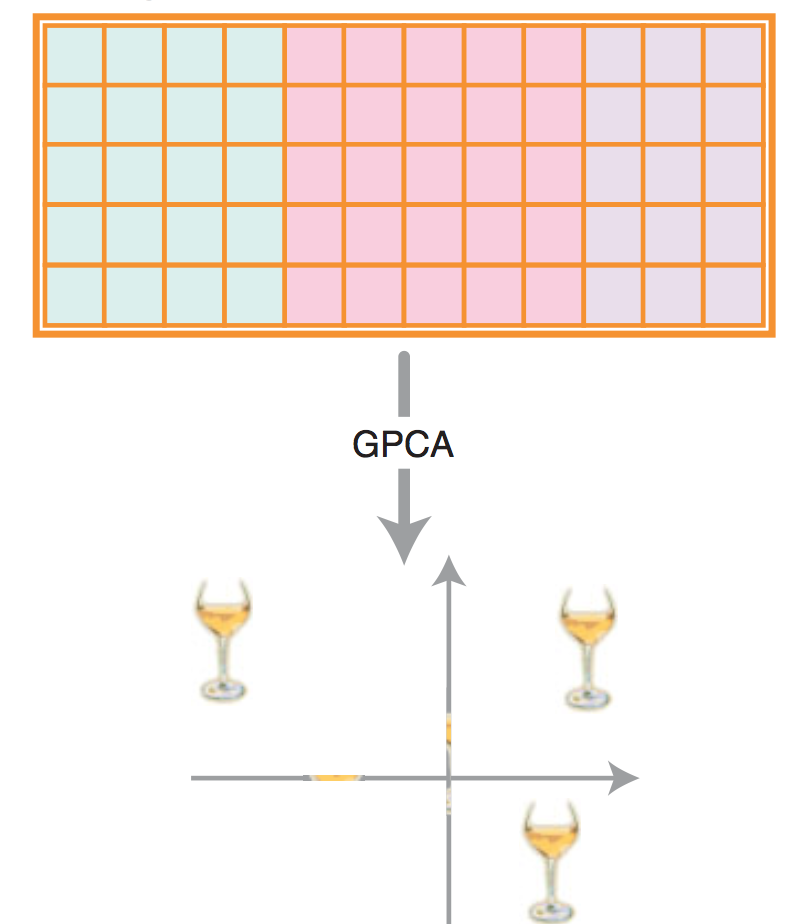

========================================================
autosize: false

<span style="position: absolute; font-size: 60px;
    top: 50%;left: 50%; margin-right: -50%; transform: translate(-50%, -50%) ">Multiple Factor Analysis in R</span>

<span style="position: absolute; font-size: 25px;
    top: 60%;left: 50%; margin-right: -50%; transform: translate(-50%, -50%) ">Dario Cantore, Josiah Davis, Yanli Fan, Yoni Ackerman</span>

Agenda
========================================================
1. The Algorithm
2. Case Study
3. Our Package
4. Appendix: GSVD

========================================================
<span style="position: absolute; font-size: 60px;
    top: 50%;left: 50%; margin-right: -50%; transform: translate(-50%, -50%) ">The Algorithm</span>

The Algorithm
========================================================
"an extension of principal component analysis tailored to handle multiple data tables that measure sets of variables collected on the same observations"

<small>Source: WIREs Comput Stat 2013. doi: 10.1002/wics.1246</small>

The Algorithm
========================================================
"an extension of principal component analysis tailored to handle multiple data tables that measure sets of variables collected on the same observations"

1. Collect multiple tables of data related to the same items
2. Calculate the singular values of each table
3. Normalize and weight the data
4. Concatenate the tables together
5. Compute a generalized singular value composition on the combined table

<small>Source: WIREs Comput Stat 2013. doi: 10.1002/wics.1246</small>

1: Collect multiple tables of data related to the same items
========================================================


Data need not have the same number of variables for in each table, but all data should have the same number of observations/items.

2: Calculate the singular values of each table
========================================================


Singular Value Decomposition is a method of factoring a rectangular matrix into three matrices that consolidate information about the variance in the data.

3: Normalize and weight the data
========================================================


In this step, each table is divided its first singular value and each observation can also be weighted. (This can be thought of as analogous to scaling variables by their variance.)

4: Concatenate the tables together
========================================================


At this point, all data points are contained in a single table and have been scaled.

Step 5. Compute a generalized singular value composition on the combined table
========================================================


The Generalized Singular Value decomposition consists of taking the singular value composition of the previously normalized-weighted data. (See appendix for details). 


The Output
========================================================

There are three major types of information to analyze:  

| Information  |  Description |
|---|---|
| Scores  | Consensus view, and how each table differs from the conesensus |
| Contributions | Most important elements: variables, observations, and tables |
| Coefficients | Similarity between the tables |


========================================================
<span style="position: absolute; font-size: 70px;
    top: 50%;left: 50%; margin-right: -50%; transform: translate(-50%, -50%) ">Case Study</span>


Wine Tasting
========================================================
Ten wine assessors were asked to rate 12 different Souvignon blancs by various criteria, among them:
- cat pee
- passion fruit
- green pepper
- mineral
 
There were twelve different wines: four from New Zealand, four from California, and four from France.

Exploratory Data Analysis
========================================================

Sample questions:

1. What wines are most similar to each other and what wine experts differed most from this consensus?
2. Which wine characteristics are the most important in explaining differences?
3. Which wine experts are most similar to each other?

Similarities and Differences
========================================================

 

<small>
The Factor Scores reveal similarities and differences:
- New Zealand wines are very different from French wines
- French wines 1 and 2 are very similar to each other
- There is greater variety in the Calfornia wines than French or New Zealand wines
</small>

Deviations from the Consensus
========================================================


<small>
The Partial Factor Scores provide a deeper understanding how different wine experts deviated from the consensus:
  - Some wine assessors (e.g., 4) thought wines from California were more similar than the rest of the group
  - A few experts (e.g., 7) noticed less regional distinctions between wines from California and New Zealand
</small>

========================================================
<span style="position: absolute; font-size: 70px;
    top: 50%;left: 50%; margin-right: -50%; transform: translate(-50%, -50%) ">Our Package</span>


Our Package
========================================================

To get started, install the mfa package from github, and call mfa with your dataset and a list of variables.


```r
library(mfa)
mfa1 <- mfa(data, sets)
```

Calling the plot function will give you summary charts to interpret your data.


```r
plot(mfa1)
```

Read our [vignette](https://github.com/fussballball/stat243FinalProject) for detailed tutorials

Available Methods 
========================================================
Here is a list of methods that the package currently supports.

| Method  |  Description |
|---|---|
| `mfa()`  |  Create the mfa object |
|  `plot()` |  Summary plots |
|  `print()` |  Basic information about the mfa object |
|  `contribution_obs_dim()` | Importance of each observation  |
|  `contribution_var_dim()` |  Importance of each variable  |
|  `contribution_table_dim()` |  Importance of each table  |
|  `summary_eigenvalues()` |  Basic information about the eigenvalues  |
|  `RV()` | Similarity between two tables  |
|  `RV_table()` | Simularity between multiples tables  |

========================================================
<span style="position: absolute; font-size: 70px;
    top: 50%;left: 50%; margin-right: -50%; transform: translate(-50%, -50%) ">Appendix: GSVD</span>


Appendix: GSVD
========================================================
The goal of Generalized Singular Value Decomposition (GSVD) is to conduct a  singular value decomposition of the form:

$$A = \tilde{U} \tilde{\Delta} \tilde{V}^\mathsf{T}$$

Notation: 
- $A$ is the data
- $\tilde{U}$ and $\tilde{V}$ are left and right singular vectors of $A$
- $\tilde{\Delta}$ is a diagonal matrix of singular values
- $M$ is a diagonal matrix of observation weights
- $W$ is a diagonal matrix of column weights

Reference: [tutorial by Hervé Abdi](http://www.cimat.mx/~alram/met_num/clases/Abdi-SVD2007-pretty.pdf)


Appendix: GSVD (Continued)
========================================================

The first step is to calculate $\tilde{A}$:

$$\tilde{A} = M^{-1/2} A W^{-1/2}$$

Note: The $W^{-1/2}$ is roughly equivalent to dividing by the singular value

The second step is to calculate the standard SVD of  $\tilde{A}$: 

$$\tilde{A} = P\Delta Q^\mathsf{T}$$

The third step is to calculate $\tilde{U}$, $\tilde{\Delta}$, $\tilde{V}$

$$\tilde{U}=M^{-1/2}P, \tilde{V}=W^{-1/2}Q, \tilde{\Delta}=\Delta$$
